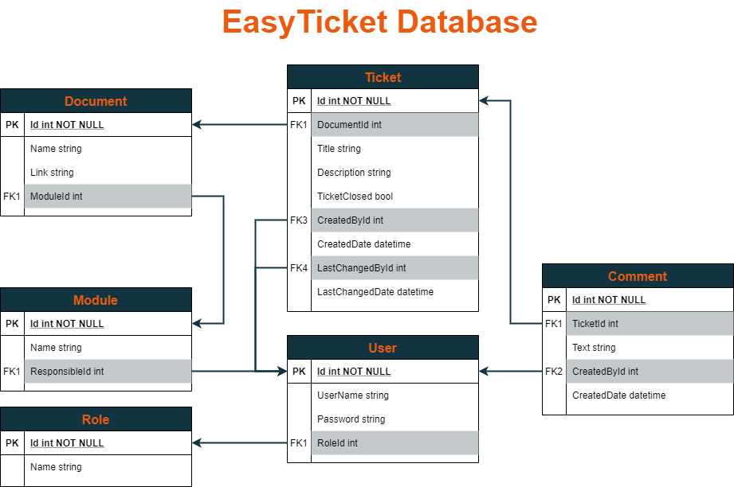

# ticketsystem_backend
## Description
Web-API build for IUBH Ticket System Prototype

For testing of this prototype ther're some users predefined:
tobias.brueckmann (Role: Tutor)
mirja.sirisko (Role: Tutor)
janina.mantel (Role: Tutor)
alexander.kathan (Role: Student)
michael.ziaja (Role: Student)
thomas.hetfeld (Role: Student)

Password for all users: 'sicher'

## Database

## Code-Structure
### Schema
Contains the Database schema.
Schema is build with [draw.io](https://draw.io).
Also contains the actual version as PDF and PNG.

### Models
Contains the Data Classes for all Database Tables.

### Data
Contains the Database Context to give access to the database based on the Data Classes.

### Migrations
- Contains the Migrations that are needed to create the Database structure
- Also contains the DbSeedData.cs that ensure that the database is created and is already seeded with sample data sets

### Controllers
Contains the Controllers (API) to access each database table.
